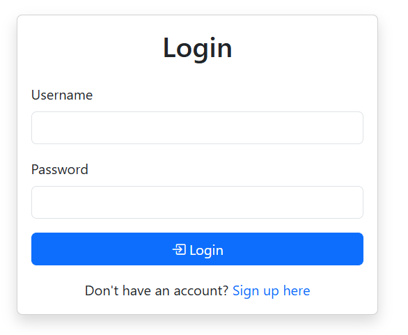
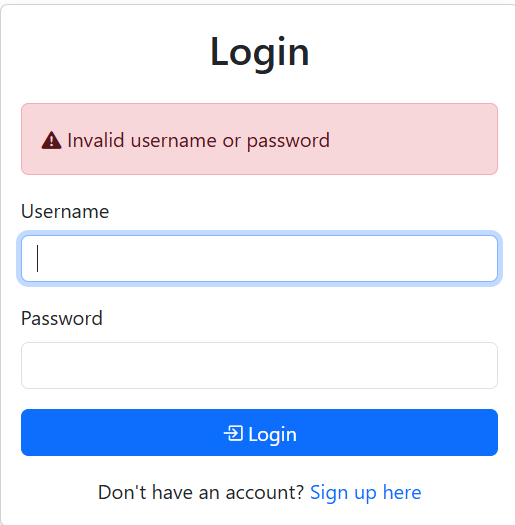
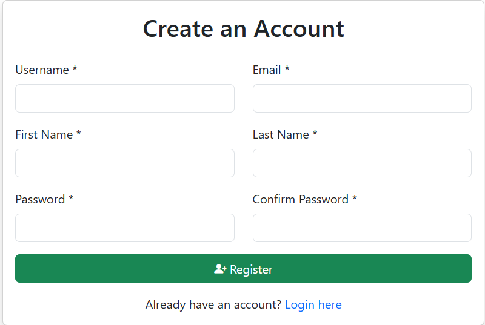
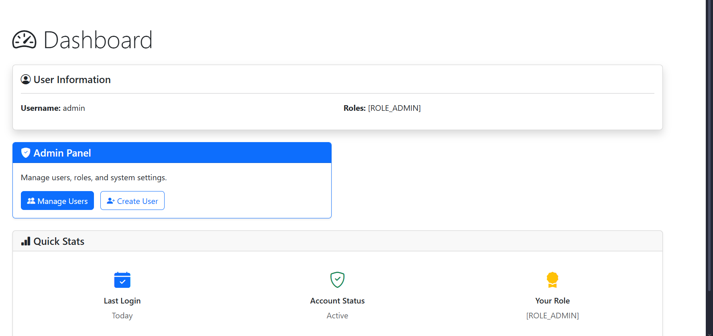
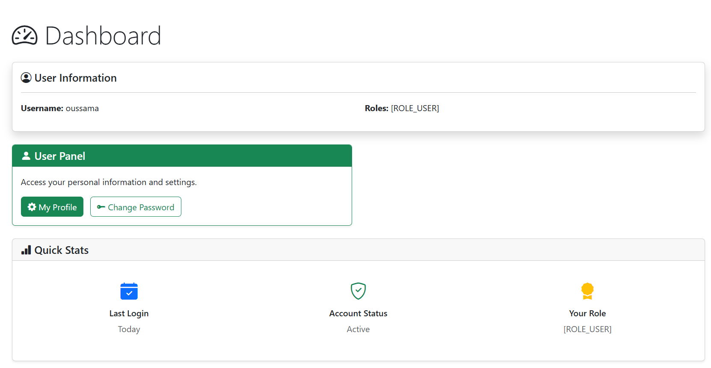
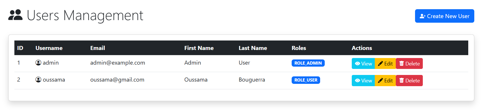
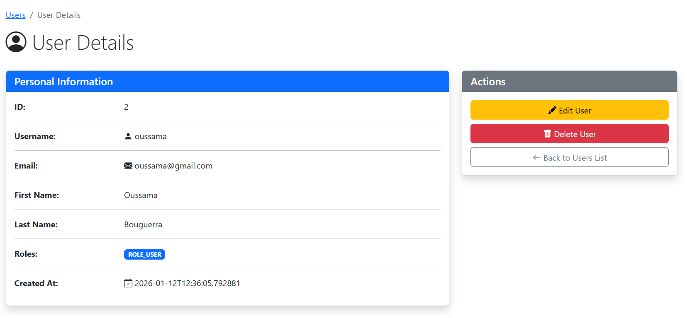
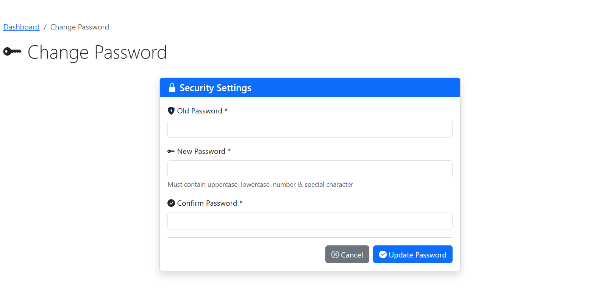

# SpringSecurityUserManagement

---

A comprehensive Spring Boot application implementing session-based authentication with role-based access control.  
This project demonstrates secure user management with admin and user roles, built using Spring Security, Spring Data JPA, Thymeleaf, and Bootstrap.

---

## Features

---

## Authentication & Authorization

- Session-based authentication with Spring Security  
- Role-based access control (ROLE_USER, ROLE_ADMIN)  
- Secure password encryption with BCrypt  
- Custom login and registration pages  

---

## User Management

- Complete CRUD operations for users  
- User registration with validation  
- Admin dashboard for user management  
- User profile viewing  
- Account enable/disable functionality  
- Role assignment  

---

## Security Features

- CSRF protection  
- Password hashing  
- Form validation  
- Error handling  

---

## Screenshots

---

### Login Page

---

### Login Error

---

### Registration Page

---

### Admin Dashboard

---

### User Dashboard

---

### User Management

---

### User Details

---

### Change Password

